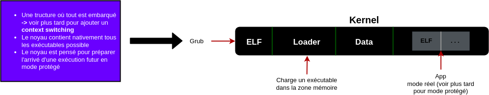
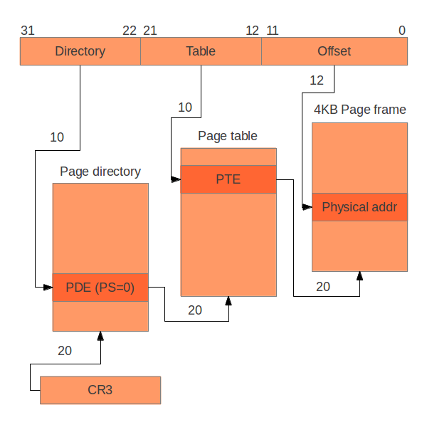
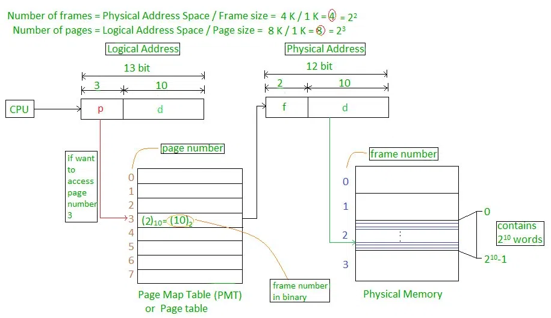

# Hachujeo_kernel

## Requirements

`sudo apt install qemu-system-x86 build-essential nasm genisoimage`

## Done

- [x] Bootloader
- [x] OS Compilation
- [x] Stack 
- [x] Calling C from assembly
- [x] C compilation
- [x] Segmentation
- [x] Interruptions
- [x] Framebuffer
  - [x] Writing text

## TODO

**Context switch**
- Paging
- Page frame allocator
- User mode

- API appels systèmes

## Worklog

### 17/01/24

Validation du sujet et discussions des objectifs à atteindre

### 24/01/24

**Travail de la semaine :**

- documentation du code en l'état actuel
- listing des points techniques déjà implémentés et de ceux à faire en priorité.
- documentation sur les fonctionnalités à commencer à implémenter pour la semaine suivante (paging, page frame allocator, user mode).

**Compte rendu de réunion :**

- Le paging (virtual memory) semble un peu ambitieux pour la semaine prochaine, on va commencer par travailler sur la segmentation, une API pour gérer les appels systèmes (sans mode protégé). Penser à un système de multitâche coopératif pour que les processus rendent la main au noyau (sortes d'appels système) et que le système choisisse le processus suivant à exécuter.
- Stub de l'API pour les appels systèmes.
- Primordial d'implémenter des appels systèmes et changer l'affichage du texte en mode graphique (framebuffer) pour qu'il utilise des appels systèmes. Regardez TRAP X86 pour les appels systèmes ou le int spécial (combinaison des 2 ?).
- Voir pour gérer l'exécution des processus en mode protégé (user mode) pour éviter qu'ils ne puissent accéder à la mémoire du noyau.
- Il faut que grub lance un noyau en mode réel, donc il faut charger un exécutable ELF qui sera en mode protégé. D'abord, dans le noyau, il faut implémenter l'API pour les appels systèmes et le mode protégé. Ensuite il est passif, il attend qu'on l'appel via une intéruptions. Faire attention aux structures de donner du noyau pour sauvegarder les états en prévision de l'arrivé du context switch.

**Objectifs :**

- 1. écrire le noyau qui va charger quelque chose
- 2. gérer les interruptions
- 3. implémenter 2 appels systèmes (exit et écriture dans le framebuffer)
- 4. Faire un mode protégé, segmentation

### 31/01/2024

- Compilation programme externe (embarqué) sans context switch

**Compte rendu de réunion :**

- penser à faire un scheduling primitif qui embarque plusieurs programmes et qui les exécute à tour de rôle
- continuer à voir les appels systèmes

### 07/02/2024

- Embarquer plusieurs programmes dans le noyau et les lancer à la suite

**Compte rendu de réunion :**

- Continuer à voir les appels systèmes
- Faire un appel système qui ne fait "rien" pour voir comment ça marche et vérifier qu'on revient bien à l'état appelant
  - exécuter 2 programme : un qui dit "bonjour", l'autre "au revoir" via un appel système 
- regarder le code du noyau linux pour context switch

### 21/02/2024

- Yield, coroutines

**Compte rendu de réunion :**

- il faut afficher d'un seul coup (sorte de print)
- le contexte switch doit se faire dans la routine
- le yield doit être en dehors du processus
- faire spawn des processus depuis les programme

## Brainstorm

### Paging

Segmentation translates a logical address into a linear address. Paging translates these linear addresses onto the physical address space, and determines access rights and how the memory should be cached.

Paging is a technique we will use to enable virtual memory. That means that each process will get the impression that the available memory range is ``0x00000000 - 0xFFFFFFFF`` even though the actual size of the memory might be much less.

#### Paging for X86

A page directory that can contain references to 1024 **page tables**, each of which can point to 1024 sections of physical memory called page frames. Each page frame is 4096 byte large.

All page directories, **page tables** and page frames need to be aligned on 4096 byte addresses. This makes it possible to address a **page directory**, **page tables** or **page frames** with just the highest 20 bits of a 32 bit address, since the lowest 12 need to be zero.

*The translation of linear addresses to physical addresses is described in the figure below*

**Mapping from virtual addresses to physical addresses exemple :**

## Terminologies

- **Logical Address or Virtual Address:** This is a deal that is generated through the CPU and used by a technique to get the right of entry to reminiscence. It is known as a logical or digital deal because it isn’t always a physical vicinity in memory but an opportunity for a connection with a place inside the device’s logical address location.
- **Logical Address Space or Virtual Address Space:** This is the set of all logical addresses generated via a software program. It is normally represented in phrases or bytes and is split into regular-duration pages in a paging scheme.
- **Physical Address:** This is a cope that corresponds to a bodily place in reminiscence. It is the actual cope with this that is available on the memory unit and is used by the memory controller to get admission to the reminiscence.
- **Physical Address Space:** This is the set of all bodily addresses that correspond to the logical addresses inside the way’s logical deal with place. It is usually represented in words or bytes and is cut up into fixed-size frames in a paging scheme.

## Ressources

- Modern Operating Systems - Andrew S. Tanenbaum
- The Little book About OS Developpement - Erik Helin & Adam Renberg : https://littleosbook.github.io
- The logical design of operating systems - Lubomir Bic & Alan C. Shaw
- ia-64 linux kernel, design and implementation - David Mosberger & Stephane Eranian
- The design of the UNIX operating system - Maurice J. Bach
- Operating System Design: The XINU Approach - Douglas Comer : https://api.pageplace.de/preview/DT0400.9781498712446_A36322972/preview-9781498712446_A36322972.pdf
- Linux Source Code : https://elixir.bootlin.com/linux/latest/source