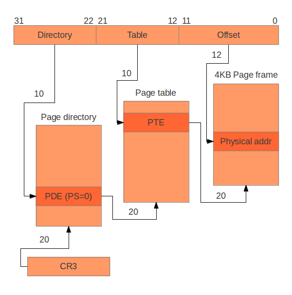

# Systèmes Avancés M2 

## Sommaire

- [Sommaire](#sommaire)
- [Trinôme](#trinome)
- [Sujet](#sujet)

---

## Trinôme
- Hugo Jacotot 71802786
- Matthieu Le Franc 71800858
- David Andrawos 21955132

---

## Sujet 

Nous voulions comprendre le plus en profondeur possible le fonctionnement d'un 
système d'exploitation de type UNIX à un niveau très bas. 

Nous avons donc décidé d'entreprendre la conception minimale d'un noyau en 
partant de zéro avec pour objectif d'arriver le plus loin possible.

---

## Qu'est-ce qu'un noyau ?

Le noyau d'un système d'exploitation (parfois appelé *kernel* de l'anglais) est 
un programme unique permettant la communication entre le matériel et le 
logiciel. C'est une partie essentielle dans la plupart des systèmes car elle 
fournit des méthodes d'abstraction aussi bien matérielles, pour la gestion des 
composants physiques, que logicielles, pour les échanges d'informations entre 
processus ou encore l'ordonnancement des tâches.

Dans beaucoup d'implémentations un noyau permet une segmentation de la mémoire 
vive en deux espaces disjoints, l'un pour l'espace noyau et un autre pour 
l'espace utilisateur, afin de séparer la zone noyau où les actions critiques 
sont effectuées de la zone utilisateur où la mémoire est protégée. 

Au service des processus, le noyau offre un ensemble de fonctionnalités 
accessibles au travers des appels système ainsi que la transmission ou la 
lecture du matériel par l'intermédiaire des interruptions. On nomme l'ensemble  
de ces actions les entrées sorties, souvent noté *I/O*. Le noyau du système 
d'exploitation forme donc un ensemble de fonctions pouvant être appelées par des 
processus souhaitant effectuer des actions "critiques" nécessitant un certain 
niveau de permissions. Le noyau prend à ce moment là le relais du processus.

---

## État initial du projet

Nous ne sommes pas exactement partis de zéro car Hugo avait déjà entrepris
d'écrire un noyau UNIX et nous sommes donc repartis de son travail existant.

Cette base de travail contenait déjà tous les mécanismes permettant de charger 
un programme en mémoire depuis GRUB. Ce programme s'occupait, au lancement, de 
mettre en place de la segmentation et d'installer les mécanismes de gestion des
interruptions aussi bien logicielles que matérielles. 

Il était donc possible d'afficher du texte à l'écran (cela permettait de 
contrôler que tout se déroulait correctement) ainsi que de saisir du texte qui 
était ensuite affiché sans possiblité de récupérer l'entrée afin de s'en servir 
dans un programme.

---

### Framebuffer

Le framebuffer permet d'afficher du texte à l'écran en modifiant directement la 
mémoire. Il est constitué de 80 colonnes et de 25 lignes. La zone de la mémoire
correspondant au framebuffer peut être représentée comme un tableau d'entiers
de 16 bits. Chaque case de ce tableau représente un caractère. 

Les 8 premiers bits de chaque case sont utilisés pour stocker le code 
[ASCII](https://fr.wikipedia.org/wiki/American_Standard_Code_for_Information_Interchange) 
du caractère que l'on souhaite afficher.

Il est également possible de choisir la couleur des caractères ainsi que la 
couleur de l'arrière-plan de ceux-ci. C'est ici que les 8 derniers bits de 
chaque case entrent en jeu:

- les 4 premiers codent la couleur du caractère 
- les 4 suivants codent la couleur de l'arrière-plan du caractère

TODO => image des couleurs et de l'ID correspondant

Pour écrire un caractère à l'écran on peut utiliser le code suivant:

```c
/*
 * Writes the specified character at the specified offset
 *
 * @param pos 	The position at which to prints the character 
 * @param c 	The character to display
 * @param fg 	The foreground color of the character
 * @param bg 	The background color of the character
 */
static void fb_write_char(unsigned int i, char c, unsigned char fg, unsigned 
                          char bg) {

    fb[i * 2] = c;
    fb[(i * 2) + 1] = ((bg & 0x0F) << 4) | (fg & 0x0F);
}
```

Dans l'architecture x86, le framebuffer se situe à l'adresse `0xB8000`.

Avec toutes ces informations en main, il est désormais possible d'écrire 
quelques fonctions permettant d'afficher du texte à l'écran facilement (faire en 
sorte que l'écran défile tout seul, retour automatique à la ligne, etc.).

---

### Segmentation

---

### Interruptions

---

### Comment compiler ?

Afin que notre noyau soit bootable, il est nécessaire de produire 
un fichier au format ISO contenant [GRUB](https://fr.wikipedia.org/wiki/GNU_GRUB).
GRUB nous permet de localiser en mémoire les structures de donnée dont nous 
auront besoin par la suite. 

Afin que le code de notre noyau puisse être localisé en mémoire par GRUB, il 
doit être chargé en mémoire après ce dernier, GRUB devant obligatoirement être 
le point d'entrée du fichier. Un fichier de configuration est donc necéssaire
afin de donner cette directive au linker.

```
ENTRY(loader)                /* the name of the entry label */

SECTIONS {
    . = 0x00100000;          /* the code should be loaded at 1 MB */

    .text ALIGN (0x1000) :   /* align at 4 KB */
    {
        *(.text)             /* all text sections from all files */
    }

    .rodata ALIGN (0x1000) : /* align at 4 KB */
    {
        *(.rodata*)          /* all read-only data sections from all files */
    }

    .data ALIGN (0x1000) :   /* align at 4 KB */
    {
        *(.data)             /* all data sections from all files */
    }

    .bss ALIGN (0x1000) :    /* align at 4 KB */
    {
        *(COMMON)            /* all COMMON sections from all files */
        *(.bss)              /* all bss sections from all files */
    }
}
```

On observe ici les différentes sections du programmes nécessaire à l'exécution:

- text: contient le code 
- data: contient les données (variables) du programme 
- rodata: contient les données en lecture-seule (Read-Only)
- bss: Block Starting Symbol, contient les variables qui n'ont pas été 
initialisées

On indique ici que le noyau doit être chargé à 1 Mio.

---

## Avancement du projet 

### Exécution de programme externe au noyau 

La première étape a été de pouvoir exécuter du code externe au noyau. C'est 
ainsi que sont exécutés les programmes appartenant à l'utilisateur dans 
les systèmes de type UNIX. La décision ayant été prise de ne pas utiliser de 
mode utilisateur, il suffit de connaitre l'adresse à laquelle le code du 
programme a été chargé pour pouvoir exécuter celui-ci.

---

## Concepts explorés mais non implémentés

### Mémoire virtuelle

#### C'est quoi ?

Avant d'entrer dans les détails d'implémentation de la mémoire virtuelle, il 
convient d'expliquer de quoi il retourne.

L'architecture x86 utilise des adresses mémoire de 32 bits de longueur, ceci 
implique qu'il n'est pas possible de posséder plus de 4Gio (2^32o) de mémoire 
car il serait impossible d'accéder aux données situées au dela de cette limite.

Lors du lancement d'un processus, il est nécessaire de lui allouer de la 
mémoire afin qu'il puisse s'exécuter. La mémoire principale est ainsi segmentée
en plusieurs petit morceau, dont l'un est attribué au processus. Le problème 
avec cette facon de procéder est que le processus ne possède qu'une fraction de 
l'espace mémoire total.

L'intérêt principal de la mémoire virtuelle est de permettre de simuler, du 
point du processus, un accès à l'intégralité de la mémoire disponible. Cela est 
fait en déchargeant les données non utilisées sur disque et en les replaçant en 
mémoire lorsqu'elle sont nécessaire.

---

#### La pagination (paging)


---



### Format ELF (Executable & Linkable Format)

(Pour David)

---

## Références 

- Figure 1: [Little OS book](https://littleosbook.github.io/)
